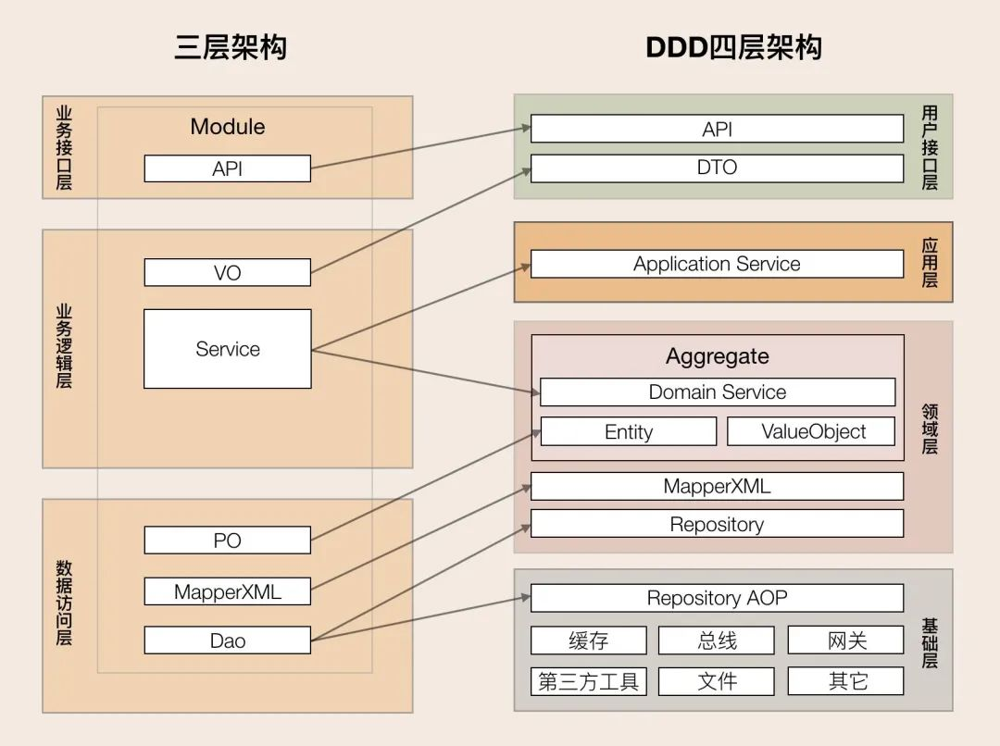

## 传统的 MVC 架构

全称是 Model-View-Controller，是一种软件设计模式，主要用于构建用户界面和应用程序逻辑的分离。

`MVC: 显示层/业务接口层（View）、控制层/业务逻辑层（Controller）、模型层/数据访问层（Model）`

主要是一种数据表驱动编程，以及面向对象编程的设计模式，适用于中小型的应用，随着业务复杂度上升，会导致控制层的代码越来越庞大，维护成本也高。

## DDD 架构
全称是 Domain-Driven Design，是一种软件设计方法，主要用于解决复杂业务场景下的软件设计问题。

`DDD: 基础设施层（Infrastructure）、领域层（Domain）、应用层（Application）、用户接口层（API）`

主要是一种面向业务的编程，以及面向领域的设计模式，适用于大型的应用。DDD的核心思想是建立统一的领域模型，领域模型不同于数据模型，和任何技术实现及存储实现无关，仅反映了业务本身。

MVC到DDD的映射：

### 基础结构层
为领域层提供基础设施，如数据库、消息队列、缓存等，不涉及业务逻辑。
### 领域层
包含业务业务所涉及的所有领域对象，如订单、商品、用户等，以及领域服务以及他们之间的关系。
### 应用层
负责协调领域层和基础设施层，不包含任何领域逻辑，主要是将要实现的功能委托给一个或多个领域对象来实现，而他只负责安排工作顺序和拼接操作的结果。
### 用户接口层
为用户提供访问交互界面和数据展示。 从用户接受查询/修改操作，展示/改变底层数据。
从用户接口层开始，用户的请求会经过应用层，应用层会调用领域层的领域对象来完成业务逻辑，领域对象会调用基础设施层的基础设施来完成数据的存储和读取。

## 传统的 MVC 和 DDD 的区别
- MVC 是一种软件开发模式，DDD 是一种软件设计方法
- MVC 是一种数据表驱动编程，DDD 是一种面向业务的编程
- MVC 是一种通用的架构模式，适用于各种类型的应用程序，而DDD 更加关注解决复杂的业务领域问题

