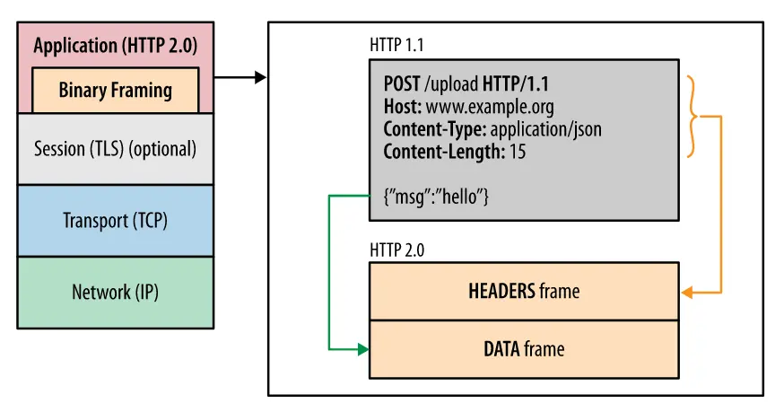
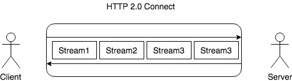
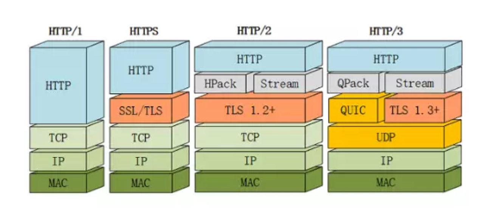

## HTTP/0.9
HTTP/0.9 是HTTP协议的第一个版本，1990年问世，是一个非常简单的协议，只支持GET方法，没有HEADER等描述数据的信息，并且服务器只能回应HTML格式的字符串，不能回应别的格式，当服务器发送完数据后，就关闭TCP连接。

## HTTP/1.0
HTTP/1.0 是HTTP协议的第二个版本，发布在1991年，任何形式的内容都可以发送，还能传输图像、视频、二进制文件，而且增加了POST等方法，增加了请求头，状态码等等功能，为互联网的发展奠定了基础。

- **无状态**：无连接的应用层协议
- **无连接**：每次请求都需要建立连接，请求结束后断开连接。如果想要建立长连接，需要在请求头中加上`Connection: keep-alive`字段
- **无法复用连接**：每个TCP连接只能发送一个请求，发送完毕后就关闭连接，如果需要请求多个资源，就需要多次建立连接
- **队头阻塞**：规定下一个请求必须等待上一个请求的响应结束后才能发送，假如上一个请求响应一直不到达，那么后面的请求就会被阻塞
- **不支持断点续传**：每次都会传送全部数据

## HTTP/1.1
HTTP/1.1 最大的改进是支持持久连接，即TCP连接默认不关闭，可以被多个请求复用，减少了建立和关闭连接的消耗和延迟，提高了传输效率，并且增加了许多方法：PUT、PATCH、HEAD、OPTIONS、DELETE。

- **长连接**：TCP连接默认不关闭(即不需要设置keep-alive)，可以被多个请求复用，如果客服端想要关闭连接，可以在请求头中加上`Connection: close`字段，要求服务器关闭TCP连接
- **管道机制**：在一个TCP连接中，客户端可以同时发送多个请求，但是服务器只能按照请求的顺序依次响应。举个例子，以前是，在一个TCP连接中，先发送A请求，等到A请求响应结束后，再发送B请求，等待B请求响应结束。现在可以同时发送A、B两个请求，但服务器只能按照A、B的顺序依次响应，如果A请求响应很慢，还是会造成队头阻塞
- **支持断点续传**：支持断点续传，即客户端可以在上次下载的地方继续下载，而不需要重新下载整个文件，这个功能是通过请求头中的`Range`字段实现的

## HTTP/2.0
HTTP/2.0之前都是基于http协议，使用明文传输，不安全，而HTTP/2.0是基于https协议，使用加密传输，安全性更高。

- **二进制分帧**：HTTP/2.0在应用层和传输层之间增加了一个二进制分帧层，将所有传输的信息分割为更小的消息和帧，并对它们采用二进制格式的编码，其中HTTP/1.x的头信息被封装到一个HEADERS帧，HTTP/2.0的数据则被封装到一个DATA帧

- **多路复用**：在HTTP/2.0中，帧是最小的数据单位，每个帧会表示出该帧属于哪个流，流是多个帧组成的数据流。多路复用意味着可以在一个TCP连接上发送多个请求，在客户端，这些帧乱序发送，但是服务器端会根据帧头的流标识符重新组装成完整的请求。这样就避免了HTTP/1.x中的队头阻塞问题

- **头部压缩**：双方各维护一个header索引表，用于存储之前传输过的header信息，每次发送请求时，只需要发送header的键名，而不需要发送header的具体内容，这样就减少了传输的数据量
- **服务器推送**：服务器可以在客户端请求之前，主动推送一些资源给客户端，这样可以提高页面的加载速度

## HTTP/3.0
HTTP/3.0是基于QUIC协议的，而QUIC是基于UDP协议的，所以HTTP/3.0是一个全新的协议，不是HTTP/2.0的升级版。

- HTTP3基于UDP协议重新定义了连接，在QUIC层实现了无序、并发字节流的传输，解决了队头阻塞问题（包括基于QPACK解决了动态表的队头阻塞）；
- HTTP3重新定义了TLS协议加密QUIC头部的方式，既提高了网络攻击成本，又降低了建立连接的速度（仅需1个RTT就可以同时完成建链与密钥协商）；
- HTTP3 将Packet、QUIC Frame、HTTP3 Frame分离，实现了连接迁移功能，降低了5G环境下高速移动设备的连接维护成本。

