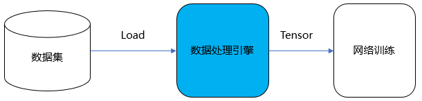
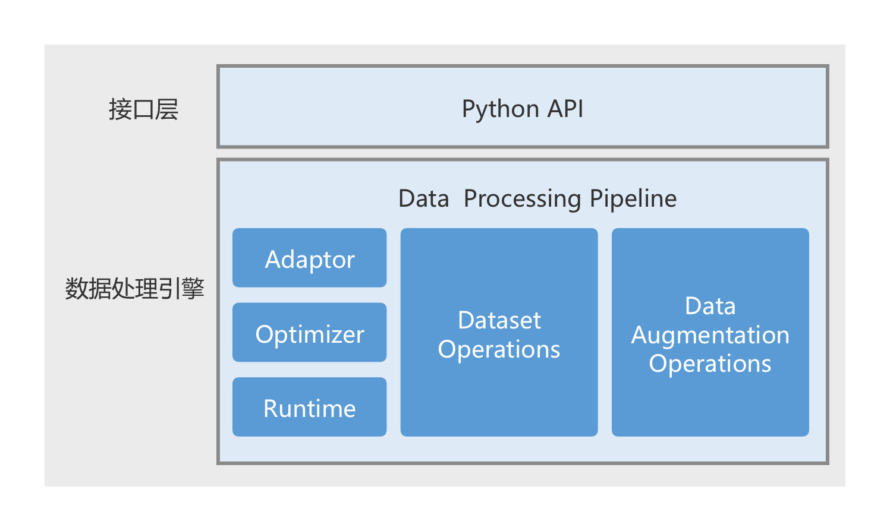
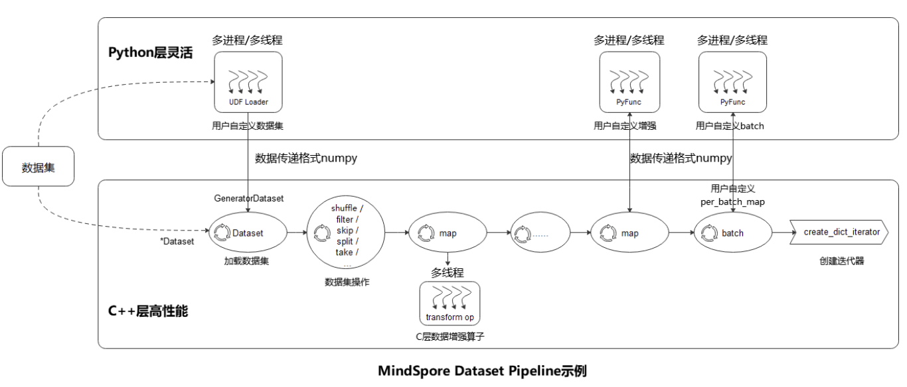
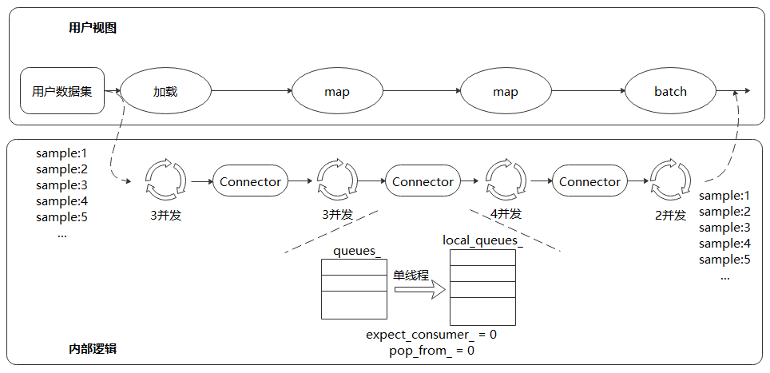
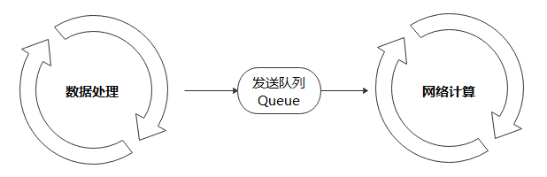
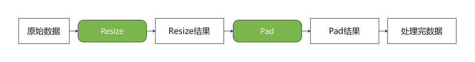

## 简介
MindSpore Dataset，简称MindData，是MindSpore的数据处理引擎，其核心是将训练样本（数据集）高效、灵活的转换至Tensor，并将该Tensor提供给训练网络用于训练。



## 数据处理引擎
### 设计方案
MindSpore的数据处理引擎设计图如上，主要由以下部分组成：



- Adaptor：适配层，将上层Python数据图，转换为下层C++数据图（Execution Tree）；
- Optimizer：数据图优化器，实现算子融合、自动参数优化等操作；
- Runtime：执行引擎，运行优化后C++数据图；
- Dataset Operations：数据集操作，例如加载数据集、数据混洗等操作；
- Data Augmentation Operations：数据增强操作，对Tensor执行特定变换，例如解码、裁剪、缩放、补齐等操作。

基于上述设计，MindSpore Dataset 提供两种数据处理能力：数据处理Pipeline模式和数据处理轻量化模式。

1. 数据处理Pipeline模式：提供基于C++ Runtime的并发数据处理流水线（Pipeline）能力。用户通过定义数据集加载、数据变换、数据Batch等流程，即可以实现数据集的高效加载、高效处理、高效Batch，且并发度可调、缓存可调等能力，实现为NPU卡训练提供零Bottle Neck的训练数据。
2. 数据处理轻量化模式：应对端侧场景资源有限的场景，支持对单张图像进行数据处理操作。

### 数据处理Pipeline模式
用户通过API定义的Dataset流水线，运行训练进程后Dataset会从数据集中循环加载数据 -> 处理 -> Batch -> 迭代器，最终用于训练。



- 加载数据集： 通过\*Dataset 类直接加载已支持的数据集，或通过 UDF Loader + GeneratorDataset 实现Python层自定义数据集的加载；
- 数据集操作：对数据集进行混洗、过滤、跳过、最多获取条数等操作；
- 数据增强：使用已支持的各类（[vision类](https://www.mindspore.cn/docs/zh-CN/master/api_python/mindspore.dataset.transforms.html#%E8%A7%86%E8%A7%89) ， [nlp类](https://www.mindspore.cn/docs/zh-CN/master/api_python/mindspore.dataset.transforms.html#%E6%96%87%E6%9C%AC) ， [audio类](https://www.mindspore.cn/docs/zh-CN/master/api_python/mindspore.dataset.transforms.html#%E9%9F%B3%E9%A2%91) ）数据增强操作添加到map操作中执行，或者自定义增强的 PyFunc ；
- 批：将数据变换操作后的样本组织分批；
- 迭代器：通过create_dict_iterator 来创建迭代器， 循环将数据输出。

MindSpore采用多段并行流水线（Multi-stage Parallel Pipeline）的方式来构建数据处理Pipeline，可以更加细粒度地规划计算资源的使用。如下图所示：



每个数据集操作都包含一个Connector，即由一组阻塞队列和计数器组成的保序缓冲队列。每个数据集操作都会从上游操作的Connector中取缓存数据进行处理，然后将这块缓存再推送到自身的Connector中。
#### connector
这里简单介绍一下MindSpore中关于connector的实现，它是一个 **多线程数据通信工具**，用于管理多个生产者（Producer）线程和消费者（Consumer）线程之间的数据流。  
`Connector` 采用 **FIFO**（先进先出）队列，保证数据按顺序消费，并使用 **条件变量（CondVar）** 和 **互斥锁（mutex）** 来控制线程间的同步。
实现方式如下：
- **多个生产者线程** 将数据推入各自的队列（Push）。
- **多个消费者线程** 按顺序从队列取数据（Pop）。
- **内部实现多个队列（QueueList\<T> queues_）**，每个生产者都有自己的队列，从而减少锁竞争。
- **保证顺序消费**，生产者按照固定顺序写入队列，避免乱序，消费者按照 `expect_consumer_` 依次读取队列数据。
如果有 3 个 Producer，数据流如下：
```bash
Producer 0 -> Queue 0 -> Pop 顺序 1
Producer 1 -> Queue 1 -> Pop 顺序 2
Producer 2 -> Queue 2 -> Pop 顺序 3
Producer 0 -> Queue 0 -> Pop 顺序 4
...轮询算法保证最终数据顺序 `[1, 2, 3, 4, 5, 6, ...]`。
```
`Connector` 主要成员变量如下：

| 变量名                 | 类型                        | 作用                                           |
| ------------------- | ------------------------- | -------------------------------------------- |
| my\_name_           | std::string               | 该 Connector 实例的唯一名称                          |
| queues_             | QueueList<T>              | 存储多个生产者的线程安全队列，每个生产者线程有自己的队列。                |
| expect\_consumer_   | int32_t                   | 期望的下一个消费者线程 ID（确保数据按顺序消费）。                   |
| pop\_from_          | size_t                    | 当前需要从哪个队列取数据（轮询方式）。                          |
| num\_producers_     | int32_t                   | 生产者线程数，即多少个线程在往 queues_ 里写入数据。               |
| num\_consumers_     | int32_t                   | 消费者线程数，即多少个线程在从 queues_ 里读取数据。               |
| m_                  | std::mutex                | 互斥锁，保证 expect\_consumer_ 和 pop_from\_ 访问的同步。 |
| cv_                 | CondVar                   | 条件变量，控制消费者线程按照 expect\_consumer_ 顺序消费数据。     |
| out\_buffers_count_ | std::atomic<std::int64_t> | 统计已取出的数据数量，支持原子操作，避免竞态条件。                    |

以 `MindDataset` 读取 `MNIST` 数据集为例：  

```python
import mindspore.dataset as ds
from download import download

url = "https://mindspore-website.obs.cn-north-4.myhuaweicloud.com/" \
      "notebook/datasets/MNIST_Data.zip"
path = download(url, "./dataset", kind="zip", replace=True)

# 1.加载数据集
dataset = ds.MnistDataset("dataset/MNIST_Data/test")
# 2. map, 数据增强
dataset = dataset.map(operations=[lambda x: x / 255.0], input_columns=["image"])
# 3. batch, 连续 64 条数据组合为一个批数据
dataset = dataset.batch(batch_size=64, drop_remainder=True)
# 4. 创建迭代器，迭代数据
for data in dataset.create_dict_iterator():
    print(f"Shape of image [N, C, H, W]: {data['image'].shape} {data['image'].dtype}")
    print(f"Shape of label: {data['label'].shape} {data['label'].dtype}")
    break
```

Connector 处理过程：

1. MnistDataset 读取数据，并通过 Connector 传递给 map 操作。
2. map 线程池并行处理数据，每个线程向 Connector 推送处理后的数据。
3. batch 操作按照 batch_size 聚合数据，并放入 Connector。
4. Iterator 从 Connector 拉取数据，交给模型训练。



### 数据处理轻量化模式
数据处理Pipeline在运行过程中会占用比较多的系统资源，包括CPU和内存。应对端侧场景资源有限的场景，支持对单张图像进行数据处理操作，这个轻量化的数据处理执行方式，称为Eager模式。

在Eager模式下，是以函数式调用的方式执行Transforms。因此代码编写会更为简洁且能立即执行得到运行结果，推荐在小型数据变换实验、模型推理等轻量化场景中使用。



以单张banana图片为例：
```python
from PIL import Image
from download import download
import mindspore.dataset.vision as vision

url = "https://mindspore-website.obs.cn-north-4.myhuaweicloud.com/notebook/datasets/banana.jpg"
download(url, './dataset/banana.jpg', replace=True)

# 1. 读取图片
img_ori = Image.open("dataset/banana.jpg").convert("RGB")
# 2. 调整图片大小(128x128)
resize_op = vision.Resize((280, 280)) 
img = resize_op(img_ori)
# 3. 对图片四周添加 10 像素的填充（默认填充黑色）
pad_op = vision.Pad(10)
img = pad_op(img)
print("Image.shape efore: {}, Image.shape After: {}".format(img_ori.size, img.size))
```

## 参考资料
[高性能数据处理引擎](https://www.mindspore.cn/docs/zh-CN/r2.4.1/design/data_engine.html)
[MindSpore-dataset](https://www.mindspore.cn/docs/zh-CN/r2.4.1/api_python/mindspore.dataset.html?highlight=dataset)
[轻量化数据处理](https://www.mindspore.cn/docs/zh-CN/master/model_train/dataset/eager.html)
