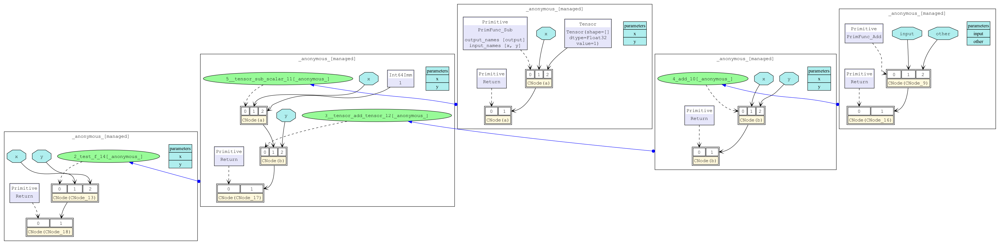

## IR
IR(Intermediate Representation，中间表示)是程序编译过程中介于源语言和目标语言之间的程序表示。编译器在完成前端工作后，会生成其自定义的IR，可以在此基础上进行各种优化操作，如模型压缩、剪枝等，最终生成目标语言。因此IR的设计不仅需要考虑从源语言到目标语言的转换难度，还需考虑程序分析和优化的易用性和性能。
### 常见的IR表示
在深度学习中，有几种常见的IR表示格式，包含但不限于：
* ONNX(Open Neural Network Exchange)：是由微软和 Facebook 联合发起的一个开源项目，后来加入了 Linux 基金会。它的目标是创建一个通用的表示形式，使得机器学习模型可以在不同的框架之间无缝迁移。
* TensorRT(TensorRT Representation)：是由 NVIDIA 开发的一个高性能深度学习推理库，旨在加速在 GPU 上运行的神经网络模型的推理过程。
* NNEF(Neural Network Exchange Format)：是由 Khronos Group 开发的一种高效的、可扩展的中间表示格式，专门设计用于在不同的硬件平台和软件工具之间交换神经网络模型。
## MindIR
MindIR(MindSpore Intermediate Representation)是一种基于图表示的函数式IR，其最核心的目的是服务于自动微分变换。自动微分采用的是基于函数式编程框架的变换方法，因此IR采用了接近于ANF函数式的语义。此外，借鉴Sea of Nodes和Thorin的优秀设计，采用了一种基于显性依赖图的表示方式。
### 文法定义
**A-Normal Form (ANF)** 是函数式编程中常用且简洁的中间表示，旨在简化解释器的结构并简化语言的转换。
```C++
<aexp> ::= NUMBER | STRING | VAR | BOOLEAN | PRIMOP
          |  (lambda (VAR …) <exp>)
<cexp> ::= (<aexp> <aexp> …)
          |  (if <aexp> <exp> <exp>)
<exp> ::= (let ([VAR <cexp>]) <exp>) | <cexp> | <aexp>
```
- **原子表达式 (aexp)**：
    - 常见的原子表达式包括：
        - 变量 (VAR，如`x`、`y`等 )
        - 常量（如布尔值BOOLEAN、数字NUMBER、字符串STRING等）
        - 函数操作符（PRIMOP，如 `+`, `-`, `*`, `=`, 等）
        - 匿名函数表达式 (如(lambda (VAR …) \<exp>)，其中 `VAR …` 表示一个或多个变量，`<exp>` 表示函数体）
- **复杂表达式 (cexp)**：
    - 常见的复杂表达式包括：
        - 函数调用（`(<aexp> <aexp> …)`，如`(+ 1 2)` 就是一个函数调用，其中 `+` 是原子表达式，`1` 和 `2` 是参数）
        - 条件表达式 (`(if aexp exp exp)`，如果 `<aexp>` 为真，执行第一个 `<exp>`，否则执行第二个 `<exp>`）
- **表达式 (exp)**：
    - 可以是原子表达式、复杂表达式或通过 `let` 绑定的表达式
    - (let (\[VAR \<cexp>]) \<exp>)，在 `let` 中，`<cexp>` 计算结果绑定到变量 `VAR`，然后在绑定的作用域内继续执行 `<exp>`

**MindIR**文法继承于**ANF**，其定义如下所示：
```C++
<ANode> ::= <ValueNode> | <ParameterNode>
<ParameterNode> ::= Parameter
<ValueNode> ::= Scalar | Named | Tensor | Type | Shape
               | Primitive | MetaFuncGraph | FuncGraph 
<CNode> ::= (<AnfNode> …)
<AnfNode> ::= <CNode> | <ANode>
```
* ANode对应ANF的原子表达式(aexp)，ANode有两个子类分别为ValueNode和ParameterNode。
	* ParameterNode，表示输入参数节点
	- ValueNode，包括具体的数据节点，如标量、符号、张量、类型、维度等，也可以是一个原语函数（Primitive）或一个元函数（MetaFuncGraph）或一个普通函数（FuncGraph）
* CNode对应ANF的复合表达式(cexp)
* AnfNode，基础节点类型，计算节点（`<CNode>`）或值节点（`<ANode>`）都属于这一类

下面以一段pythonh函数作为示例，理解ANF及MindIR:

```python
import mindspore as ms

# 使用ms.jit装饰器，使被装饰的函数以静态图模式运行
@ms.jit
def test_f(x, y):
    a = x - 1
    b = a + y
    return b

if __name__ == '__main__':
	# save_graphs=3 会打印后缀名为 .dot 的图形化格式的ir文件   
	ms.set_context(mode=ms.GRAPH_MODE, save_graphs=3, save_graphs_path='/home/candyhong/workspace/develop/graph')

    x = ms.Tensor([7], ms.float32)
    y = ms.Tensor([77], ms.float32)
    print(test_f(x, y))
```

ANF 表达式为：

```C++
lambda (x, y)
    let a = x - 1 in
    let b = a + y in
    b end
```

mindspore可以通过`set_context(save_graphs=True)`来保存各个编译阶段的中间代码。被保存的中间代码有两种格式，一个是后缀名为`.ir`的文本格式，一个是后缀名为`.dot`的图形化格式。当网络规模不大时，建议使用更直观的图形化格式来查看，当网络规模较大时建议使用更高效的文本格式来查看。下面是将.dot文件转换为 png 文件方法：

```bash
# 首先需要安装Graphviz软件包
brew install graphviz

# 将dot转换为png
dot -Tpng *.dot -o *.png
```



在MindIR中，一个函数图（FuncGraph）表示一个普通函数的定义，函数图一般由ParameterNode、ValueNode和CNode组成有向无环图，可以清晰地表达出从参数到返回值的计算过程。其中紫色表示ValueNode，蓝色表示ParameterNode，黄色的表示CNode，CNode的第一个输入链接着调用的函数，如test_f、sub、add等，CNode的其他输入链接这调用的参数，参数值可以来自于ParameterNode、ValueNode和其他CNode。
由上图可知，最右侧表示test_f整个函数定义，图二表示函数的具体逻辑，先调用sub然后再调用add函数，最后return其结果。

## 参考资料
[全场景统一架构](https://www.mindspore.cn/docs/zh-CN/master/design/all_scenarios.html)