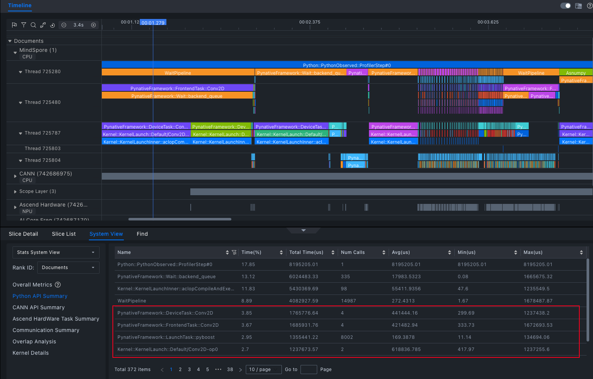
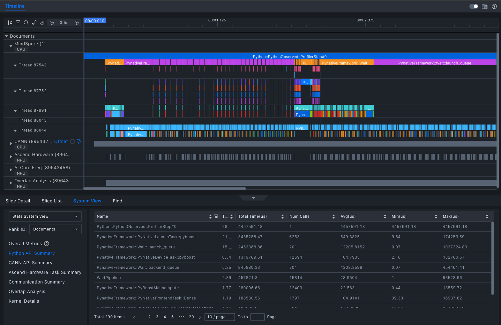

Whisper 是由 OpenAI 开发的多语言语音识别模型。一经开源受到开发者广泛关注和使用，在使用中遇到其耗时过高问题，一段 91 秒的音频，识别耗时长达 95 秒， 推理效率不足，难以满足实时应用需求。

本文将系统分享我们在MindSpore 2.5.0 + MindSpore NLP 0.4.0环境下，通过引入FlashAttention 2 与优化Conv1D，借助MindSpore Profiler[1]精准定位瓶颈，最终将Whisper模型推理耗时压缩至60秒以内的全过程。

目前该模型已上线模力方舟，点击阅读原文可直接体验。

https://ai.gitee.com/serverless-api/packages/1495?model=whisper-large-v3&package=1495

## 一、三种注意力机制对比
| 模式                        | 特点                           | 适用场景   |
| ------------------------- | ---------------------------- | ------ |
| **Eager**                 | 直接计算完整注意力机制                  | 短序列    |
| **SDPA**                  | 通过缩放点积计算注意力权重，优化显存使用         | 中等长度序列 |
| **FlashAttention 2（FA2）** | ”分块处理+重计算“，避免存储完整矩阵，大幅降低显存消耗 | 长序列任务  |

**FlashAttention 2** 为何能加速？想象一下拼图游戏：
1. 切块处理：就像无法一次性处理超大图片，FA2将长序列切分成与硬件缓存匹配的“小拼图”分批处理，避免内存爆炸。
2. 分块统计：在每个“小拼图”内，先扫描计算关键统计量（如最大值、归一化因子），相当于找出每块图像的“关键特征”。
3. 按需重算：​​反向传播时，仅需保存少量统计量，按需重新计算中间结果，极大节省显存
这样的”分块处理＋重计算“策略，显著降低了显存使用，提高了并行计算效率，特别适用于语音识别等需要处理超长序列的任务。

## 二、接入 FlashAttention2 模式
我们将FlashAttention 2集成到MIndSpore NLP中，具体流程[2]如下：
### 1. 核心适配：
* 移植 `flash-attn` 库中处理填充(Padding)的关键函数 (`index_put_first_axis`, `index_first_axis`, `unpad_input`, `pad_input`)
* 新增 `modeling_flash_attention_utils.py` 模块，实现支撑 FA2 的辅助函数（如 `_get_unpad_data`, `_flash_attention_forward` 等）
### 2. 模型改造：
* 在 `modeling_whisper.py` 中新增 `WhisperFlashAttention2` 模块
* 用户只需在初始化模型时设置 `attn_implementation="flash_attention_2"` 即可启用FA2
### 3. 初站告捷：
* 91秒音频推理时间从 ​**​95秒降至约85秒​**​，性能提升约 ​**​10%​**​， 但性能仍有优化空间。

## 三、Profiler 精准定位瓶颈：Conv1D 成“罪魁祸首”
初步优化后性能仍有瓶颈？MindSpore Profiler成为关键突破口！
### 1. Profiler：性能瓶颈的“显微镜”​
* 功能强大：MindSpore 官方性能调优利器，能够对神经网络的各个环节进行精细的性能采集和分析
* 使用便捷：只需先创建并初始化Profiler对象，设置采集级别和调度策略，然后在推理过程中自动收集数据
```python
import mindspore
from mindnlp.transformers import AutoModelForSpeechSeq2Seq, AutoProcessor, pipeline
from mindspore.profiler import ProfilerLevel, schedule, tensorboard_trace_handler

model_id = "openai/whisper-large-v3"
model = AutoModelForSpeechSeq2Seq.from_pretrained(
    model_id, 
    ms_dtype=mindspore.float16, 
    low_cpu_mem_usage=True,
    use_safetensors=True,
    attn_implementation="flash_attention_2",
)
processor = AutoProcessor.from_pretrained(model_id)
pipe = pipeline(
    "automatic-speech-recognition",
    model=model,
    tokenizer=processor.tokenizer,
    feature_extractor=processor.feature_extractor,
    ms_dtype=mindspore.float16,
    return_timestamps=True,
)
experimental_config = mindspore.profiler._ExperimentalConfig(
                            profiler_level=ProfilerLevel.Level0,
                            aic_metrics=AicoreMetrics.AiCoreNone,
                            l2_cache=False,
                            mstx=False,
                            data_simplification=False,
                            export_type=[ExportType.Text])
# Profiler 数据默认存储在路径：
# ./data/modelfoundry-prod-node-xxx/ASCEND_PROFILER_OUTPUT
with mindspore.profiler.profile(
    activities=[ProfilerActivity.CPU, ProfilerActivity.NPU],
    schedule=mindspore.profiler.schedule(wait=0, warmup=0, active=1, repeat=1, skip_first=0),
    on_trace_ready=mindspore.profiler.tensorboard_trace_handler("./data"),
    profile_memory=False,
    experimental_config=experimental_config
    ) as prof:
    pipe("/path/to/yourself.mp3") # 运行你的推理代码
    prof.step()
```
* 可视化分析：使用MindStudio Insight[3]或浏览器内置的Trace Viewer分析生成的timeline文件。

### 2. 性能瓶颈：低效的Conv1D实现​
使用 **MindSpore Studio（版本 8.0.RC1）** 对 timeline 文件进行分析后，可清晰定位性能瓶颈：
* 瓶颈算子：`Conv1D`
* 问题根源：旧版本MindSpore (<=2.5.0)的 `Conv1D` 是通过 `Conv2D` 间接模拟实现的：
	- 存在​**​多余的维度转换​**​操作
	- 计算主要在 ​CPU​​ 上执行，无法利用 NPU 加速
	- 导致​**​频繁的内存拷贝​**​，拖累整体速度



### 3. 解决方案：引入高效 Conv1D 实现
自 **MindSpore 2.6.0** 起，框架已提供更高效的 Conv1D 实现，支持图模式和硬件加速。将框架升级到 ​**​MindSpore 2.6.0​**​ 并适配新版的 `Conv1D` 后，结合之前集成的 `FlashAttention 2`：
* - 推理耗时由原来的95秒优化至平均**60秒内**，满足准实时需求（RTF<1）
* 相比原始版本提升超过 **35%**
* **CPU占用率显著下降​**​，资源利用更高效



## 四、手把手推理教程
想亲身体验优化后的超快Whisper？跟着以下步骤操作：
### 1. 下载镜像
执行以下Shell命令，拉取 MindSpore 容器镜像：
```bash
docker pull quay.io/ascend/mindspore:openeuler-python3.10-cann8.1.rc1-mindspore2.6.0rc1
# 推荐国内源加速
# docker pull quay.xzt.me/ascend/mindspore:openeuler-python3.10-cann8.1.rc1-mindspore2.6.0rc1
```
### 2. 创建并进入容器
执行以下命令创建容器，name 设置为 whisper：
```bash
docker run -itd --privileged  --name=whisper --net=host \
   --shm-size 500g \
   --device=/dev/davinci0 \
   --device=/dev/davinci1 \
   --device=/dev/davinci2 \
   --device=/dev/davinci3 \
   --device=/dev/davinci4 \
   --device=/dev/davinci5 \
   --device=/dev/davinci6 \
   --device=/dev/davinci7 \
   --device=/dev/davinci_manager \
   --device=/dev/hisi_hdc \
   --device /dev/devmm_svm \
   -v /usr/local/Ascend/driver:/usr/local/Ascend/driver \
   -v /usr/local/Ascend/firmware:/usr/local/Ascend/firmware \
   -v /usr/local/sbin/npu-smi:/usr/local/sbin/npu-smi \
   -v /usr/local/sbin:/usr/local/sbin \
   -v /etc/hccn.conf:/etc/hccn.conf \
   quay.io/ascend/mindspore:openeuler-python3.10-cann8.1.rc1-mindspore2.6.0rc1 \
   bash
```
进入容器，后续所有操作均在容器内操作
```bash
docker exec -it whisper bash
```
### 3. 安装 MindSpore NLP 与依赖
执行以下脚本，安装 MindSpore NLP 及相关依赖包：
```bash
# 安装相关依赖
yum install ffmpeg git
# 配置国内源
pip config set global.index-url https://repo.huaweicloud.com/repository/pypi/simple/ 
# 升级 pip
pip install --upgrade pip
# 安装 mindnlp
git clone -b 0.4 https://github.com/mindspore-lab/mindnlp.git
cd mindnlp
bash scripts/build_and_reinstall.sh
```
### 4. 推理代码示例

```python
import mindspore
from mindnlp.transformers import AutoModelForSpeechSeq2Seq, AutoProcessor, pipeline

# 国内可设置HF镜像 (可选) 
import os 
os.environ['HF_ENDPOINT'] = 'https://hf-mirror.com'

# 加载模型与处理器，启用FlashAttention 2
model_id = "openai/whisper-large-v3"
model = AutoModelForSpeechSeq2Seq.from_pretrained(
    model_id, 
    ms_dtype=mindspore.float16, 
    low_cpu_mem_usage=True,
    use_safetensors=True,
    attn_implementation="flash_attention_2",
)
processor = AutoProcessor.from_pretrained(model_id)

# 创建推理管道
pipe = pipeline(
    "automatic-speech-recognition",
    model=model,
    tokenizer=processor.tokenizer,
    feature_extractor=processor.feature_extractor,
    ms_dtype=mindspore.float16,
    return_timestamps=True,
)

# 执行推理
audio_file = "/path/to/your/audio.mp3" # 替换为你的音频文件路径
result = pipe(audio_file)
print(result["text"])    # 打印识别结果
```

## 引用
[1] MindSpore 性能采集工具 Profiler:
https://www.mindspore.cn/docs/zh-CN/r2.6.0/api_python/mindspore/mindspore.Profiler.html
[2] Whisper接入FlashAttention2 流程: https://github.com/mindspore-lab/mindnlp/pull/2018
[3] MindStudio Insight工具下载: 
https://www.hiascend.com/developer/download/community/result?module=sto

原文作者:hongziqi
首发于昇思MindSpore公众号，转载到开源时刻等平台:
https://mp.weixin.qq.com/s/0MAHoQoxKBnWOPou-h5nJg
https://mp.weixin.qq.com/s/tR8hIKX9GGZ8w7ROrQLtVg
