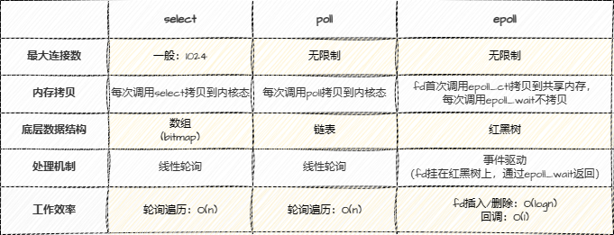

### IO多路复用
多路：多个文件描述符（socket）
复用：一个线程（进程）处理多个文件描述符
IO多路复用：一个线程（进程）可以同时监听多个文件描述符，当某个文件描述符就绪时，能够通知应用程序进行处理，没有就绪的文件描述符则继续监听。

### IO模型
Linux 有五中IO模型：
* blocking IO(BIO) - 阻塞IO模型
* non-blocking IO(NIO) - 非阻塞IO模型
* signal driven IO - 信号驱动IO模型
* asynchronous IO - 异步IO模型
* IO multiplexing - IO多路复用模型

#### 阻塞IO模型(BIO)
这是最简单的IO模型，应用程序发起IO操作后，一直等到成功或者失败才返回，在返回前程序会被阻塞。


下面，针对单线程和多线程简述一下该模型的缺点。
* 单线程服务器：一个连接的IO操作会阻塞整个服务器，无法处理其他连接，必须等待上一个IO操作处理完，无法处理并发。
* 多线程服务器：当一个连接的IO操作阻塞时，线程会被挂起，新增线程处理其他的请求，虽然可以处理并发，但是当连接数增多时，线程数也会增多，线程切换开销大，大量的线程也占用了很多的系统资源。


#### 非阻塞IO模型(NIO)
应用程序发起IO操作后，加入一个非阻塞IO事件集合，每次轮询遍历该集合，如果没有准备好数据，则返回EAGAIN，有则直接返回。

* 进程轮询：每次轮询都要遍历IO事件，浪费CPU资源。
* 适用于连接数少，且不需要及时响应的应用程序。

#### 信号驱动IO模型
应用程序发起IO操作后，会向内核注册一个信号处理函数，然后直接返回(不阻塞)；当IO操作完成时，内核会向应用程序发送一个信号，应用程序收到信号后，再在信号处理函数中进行IO操作。

当进程没有收到SIGIO信号前，可以做其他事情，不会阻塞，由于信号驱动，可以避免大量无效的轮询操作。但是当IO请求增大时，信号产生的频率也会增大，导致信号处理函数的调用开销增大。


#### 异步IO模型
应用程序发起IO操作后，直接返回，内核会在IO操作完成后通知应用程序。看起来是和信号驱动IO模型类似，但是异步IO模型是内核完成IO操作后，直接将数据拷贝到用户空间，而不是通知应用程序，应用程序再去拷贝数据。


#### IO多路复用模型
IO多路复用就是通过一种机制，一个进程监听多个文件描述符，当某个文件描述符就绪时，能够通知应用程序进行处理，没有就绪的文件描述符则继续监听。
听起来和信号驱动IO模型类似，但是IO多路复用模型是通过一个系统调用，一次性监听多个文件描述符，而不是一个一个的监听。

支持的系统调用有select、poll、epoll，它们本质上都是同步IO，因为它们都需要在读写事件准备好后，由应用程序自己负责读写，也就是说读写操作是阻塞的。而异步IO则是由内核负责读写，应用程序只需要等待通知即可。
##### select
相关函数定义如下：
```
/* According to POSIX.1-2001, POSIX.1-2008 */
#include <sys/select.h>
/* According to earlier standards */
#include <sys/time.h>
#include <sys/types.h>
#include <unistd.h>

/* 
* typedef struct{
*    long int fds_bits[32];
* }fd_set;
* fd_set 就是一个long int类型的数组(32位系统数组大小为32,64位系统数组大小为64)，可以理解为一个bitmap，每个bit位代表一个文件描述符，最多支持1024个文件描述符
* readfds：监控有读数据到达文件描述符集合
* writefds：监控写数据到达文件描述符集合
* exceptfds：监控异常事件文件描述符集合
* nfds：max{readfds, writefds, exceptfds} + 1
* timeout：用户线程调用select的超时时间
* - NULL：阻塞等待
* - 0：立即返回
* - >0：等待指定时间
* 函数返回值：就绪的文件描述符个数
* - >0：就绪的文件描述符个数
* - 0：没有就绪的文件描述符
* - -1：调用失败
*/
int select(int nfds, fd_set *readfds, fd_set *writefds,
            fd_set *exceptfds, struct timeval *timeout);

// 将文件描述符fd从set集合中删除 
void FD_CLR(int fd, fd_set *set); 

// 判断文件描述符fd是否在set集合中 
int  FD_ISSET(int fd, fd_set *set); 

// 将文件描述符fd添加到set集合中 
void FD_SET(int fd, fd_set *set); 

// 将set集合中, 所有文件描述符对应的标志位设置为0
void FD_ZERO(fd_set *set);
```
简述select的工作流程：
1. 应用程序调用select，将需要监听的文件描述符(fd)集合传递给内核
2. 内核检查每个文件描述符是否就绪，如果有就绪的文件描述符，则将其加入到就绪队列中
3. select返回，应用程序遍历监听的文件描述符，处理就绪的文件描述符

伪代码如下：
```
/* 
* select服务端伪码
* 首先一个线程不断接受客户端连接，每个连接就是一个文件描述符(fd)，然后不断塞入fdlist里面。
*/
while(1) {
  connfd = accept(listenfd);
  fcntl(connfd, F_SETFL, O_NONBLOCK);
  fdlist.add(connfd);
}

struct timeval timeout;
int max = 0;  // 用于记录最大的fd，在轮询中时刻更新即可
FD_ZERO(&read_fd); // 初始化比特位
while (1) {
    // 将需要监听的fd从用户态拷贝到内核态，然后内核检查每个fd是否就绪，返回原来的fd集合，但就绪的fd会被置位
    nfds = select(max+1, &readfds, &writefds, NULL, timeout);
    // 2. 遍历监听的文件描述符，处理就绪的文件描述符
    for (int i = 0; i <= max && nfds; i++) {
        // 只读已就绪的文件描述符，不用过多遍历
        if (i == listenfd) {
            // 这里处理accept事件
            FD_SET(i, &read_fd);//将就绪的文件描述符加入到read_fd中
        }
        if (FD_ISSET(i, &read_fd)) {
            // 这里处理read事件
        }
    }
}
```
可以通过下面的视频了解select的运作流程：

<video src="videos/select.mp4" autoplay="true" controls="controls" width="400" height="400"></video>

针对这个模型，有以下几个缺点：
* 需要维护一个存放大量fd的集合，每次调用select都需要将fd集合从用户态拷贝到内核态，这个开销是很大的
* select支持监听的fd有限，是由单个进程能打开的最大连接数是由FD_SETSIZE决定的(32位机器默认是1024，64位机器默认为2048)，虽然可以修改宏FD_SETSIZE(定义在 `/proc/sys/fs/file-max` 文件)，但随着fd的增多，内核需要遍历的fd也会增多，导致效率降低。
* select返回后，由于不知道有多少个就绪的fd，应用程序需要遍历所有的fd，找到就绪的fd，这个过程是串行的，效率低下。

##### poll
poll 和 select 类似，也是同步IO多路复用模型，但是poll没有select的限制，没有最大连接数的限制，也没有fd_set的限制，而是通过`pollfd`结构体来传递文件描述符。
相关函数定义如下：
```
#include <poll.h>
struct pollfd {
    int fd;         /* 文件描述符 */
    short events;   /* 监听的事件 */
    short revents;  /* 就绪的事件 */
};

int poll(struct pollfd *fds, unsigned long nfds, int timeout);
```
poll 本质上和 select 是一样的，只不过 poll 没有使用bitmap记录fd的状态，而是使用 `pollfd` 结构体，这样就避免了 select 的最大连接数限制，而且用`revents`标记是否有数据，这样每次有就绪的时间只需要重置`revents`，而select需要重置整个`fd_set`。
但是 poll 也有和 select 一样的缺点，并没有优化大量描述符数组从用户态复制到内核态的消耗问题，而且 poll 返回后，仍需要遍历所有的`pollfd`结构体，找到就绪的fd，这个过程依旧效率低下。

##### epoll
epoll 是 Linux 2.6 内核提供的 IO 多路复用接口，也是目前最好的 IO 多路复用模型，它没有描述符限制，它是通过内核和用户空间共享一块内存来实现的，这样就避免了大量描述符数组从用户态复制到内核态的消耗问题。
epoll 的接口只有三个：
* epoll_create：创建一个 epoll 对象
* epoll_ctl：注册需要监听的事件
* epoll_wait：等待事件发生

epoll 的工作流程如下：
1. 应用程序调用 epoll_create 创建一个 epoll 对象
2. 应用程序调用 epoll_ctl 将需要监听的文件描述符加入到 epoll 对象中
3. 应用程序调用 epoll_wait 等待事件发生
4. 内核检查每个文件描述符是否就绪，如果有就绪的文件描述符，则将其加入到就绪队列中
5. epoll_wait 返回，应用程序遍历就绪队列，处理就绪的文件描述符
6. 应用程序调用 epoll_ctl 将就绪的文件描述符从 epoll 对象中删除
7. 重复 3-6 步骤

可以通过下面的视频了解epoll的运作流程：
<video src="videos/epoll.mp4" autoplay="true" controls="controls" width="400" height="400"></video>

而一般，epoll 有两种事件触发模式：
* 水平触发(level-triggered,LT)：默认模式，只要有数据就绪，就会触发事件，如果应用程序没有处理完数据，下次还会触发事件。
* 边缘触发(edge-triggered,ET)：只有缓冲区的事件有变化时，才会触发事件，比如缓冲区的数据从有到无，从无到有，数据增多或变少，都会触发。
如果使用ET模式，需要一次性将缓冲区的数据读/写完，否则下次调用epoll_wait就不会触发通知。ET模式很大程度上减少了事件的触发次数，提高了效率。
但是ET模式也有一个缺点，就是必须将文件描述符设置为非阻塞模式，以避免由于一个文件描述符阻塞导致其他文件描述符无法处理。

epoll 的优点：
* 没有最大连接数限制。
* epoll 中内核和用户空间共享一块内存，避免了大量描述符数组从用户态复制到内核态的消耗问题，而且可以在多个线程中共享 epoll 对象，使用更加灵活。
* epoll_wait 只返回就绪的文件描述符，不需要遍历所有的文件描述符，效率更高。

##### select、poll、epoll的区别



[//]: # (|     | select       | poll       | epoll                                    |)

[//]: # (|-----|--------------|------------|------------------------------------------|)

[//]: # (| 连接数 | 一般为1024      | 无限制        | 无限制                                      |)

[//]: # (| 内存拷贝 | 每次调用select拷贝 | 每次调用poll拷贝 | fd首次调用epoll_ctl拷贝到共享内存，每次调用epoll_wait不拷贝 |)

[//]: # (| 底层结构 | bitmap       | 数组         | 红黑树                                      |)

[//]: # (| 处理机制 | 线性轮询         | 线性轮询         | 事件驱动&#40;fd挂在红黑树，通过epoll_wait返回&#41;             |)

[//]: # (| 工作效率 | 轮询：O&#40;n&#41;      | 轮询：O&#40;n&#41;       | fd插入/删除：O&#40;logn&#41;， 回调：O&#40;1&#41;                 |)
### 参考
[IO多路复用——深入浅出理解select、poll、epoll的实现](https://zhuanlan.zhihu.com/p/367591714)


